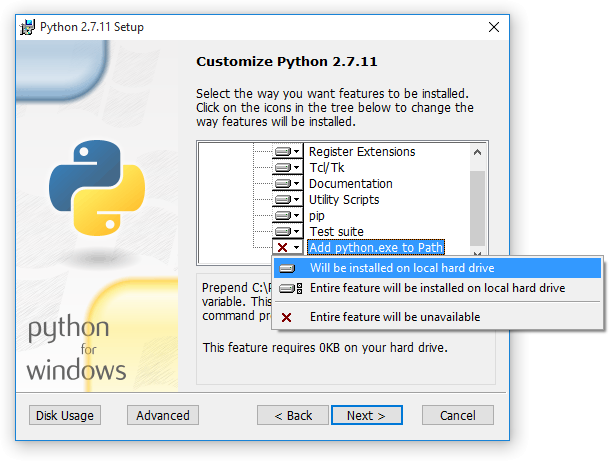

# ChibiOS/RTのVeriFastによる検証 (Windows版)

[ChibiOS/RT](http://www.chibios.org/)上で動作するアプリケーションを[VeriFast](https://people.cs.kuleuven.be/~bart.jacobs/verifast/)で検証します。

## 準備

以下をインストールしてください。

* [MinGW](http://www.mingw.org/wiki/Getting_Started)
* [Git](https://git-for-windows.github.io/)
* [Python 2.7.x](https://www.python.org/downloads/)

上記のPythonをインストールする際、`Add python.exe to Path` を選択してください。



[VeriFastの最新版をダウンロード](https://github.com/verifast/verifast#binaries)し、展開して `verifast-XXXXXXX\bin` ディレクトリにPATHを通してください。

`C:\MinGW\msys\1.0\msys.bat` によって起動されるコンソールから、本ソースコードをダウンロードして、ツールチェーンを設定してください。

```
$ git clone https://github.com/fpiot/chibios-verifast.git
$ cd chibios-verifast
$ make setup
```

## 検証

VeriFastでソースコードを検証するには、以下のようにしてVeriFast IDEを起動してください。

```
$ cd chibios-verifast/verifast_demo/STM32/RT-STM32F091RC-NUCLEO
$ make vfide
```

## ビルド

ソースコードをビルドしてください。

```
$ cd chibios-verifast/verifast_demo/STM32/RT-STM32F091RC-NUCLEO
$ make
```

## 実機動作

ボードとLinux PCをUSBケーブルで接続した後、st-utilを起動して待機中にしてください。

```
$ cd chibios-verifast/verifast_demo/STM32/RT-STM32F091RC-NUCLEO
$ make st-util
```

別のコンソールを開いて、gdbserver経由でファームウェアを書き込み

```
$ cd chibios-verifast/verifast_demo/STM32/RT-STM32F091RC-NUCLEO
$ make gdbwrite
```

gdbのプロンプトが出るので、実行継続してください。

```
(gdb) c
```
